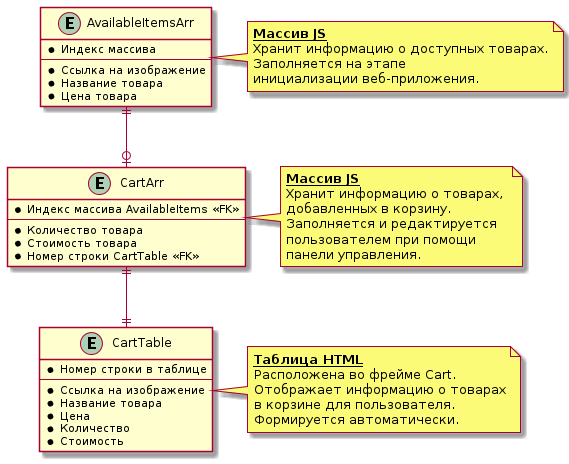

# "Веб-программирование на клиентской стороне"

## Сведения о работе
ЛР №2 по дисциплине ОСПО (ВолгГТУ).
## Цель работы
Изучить структуру фреймового документа **HTML**. Научиться создавать динамические, активные документы **HTML** с
использованием технологий **JavaScript** и **DynamicHTML**.
## Задание
Вариант №2:

*Отбор товара в простейшем Интернет-магазине. Документ разделён на 2 фрейма. В первом перечислен имеющийся товар (не менее 5 видов) в виде небольшой пиктограммы, названия и цены за единицу. Второй фрейм - "корзина". Если пользователь дважды щёлкает по товару в первом фрейме, то ему предлагается в строке ввода ввести число единиц товара, которое необходимо добавить в корзину. Имеется кнопка очистки корзины. Корзина должна представлять собой отчёт, в котором имеется информация о товаре в корзине и общей сумме.*

## Блок-схемы
Блок-схемы подготовлены при помощи [PlantUML](https://plantuml.com/en/).
### Диаграмма состояний UML
Работа веб-приложения описана при помощи диаграммы состояний ассоциированного с ней конечного автомата

### Реляционная модель
Для описания на логическом уровне простейшей встроенной базы данных, используемой в данном веб-приложении, подготовлена реляционная модель.

## Веб-приложение и его код
Код - см. файл [index.html](index.html)

Работоспособность веб-приложения можно проверить по следующей [ссылке](https://codedesign2763.github.io/).

Некоторые интересные моменты в коде:

1.	Замыкания.
2.	Работа с объектами.
3.	Работа с массивами.
4.	Обработка событий.
5.	Блокировка клавиши `Enter` для управляющих элементов.

Особенность - использование фреймов без атрибута `src` с последующим их заполнением при помощи JavaScript из-за проблем с [Same Origin Policy](https://developer.mozilla.org/ru/docs/Web/Security/Same-origin_policy) на фоне отладки кода без применения сервера. 

## Cнимки экрана
### Снимок №1

### Снимок №2

